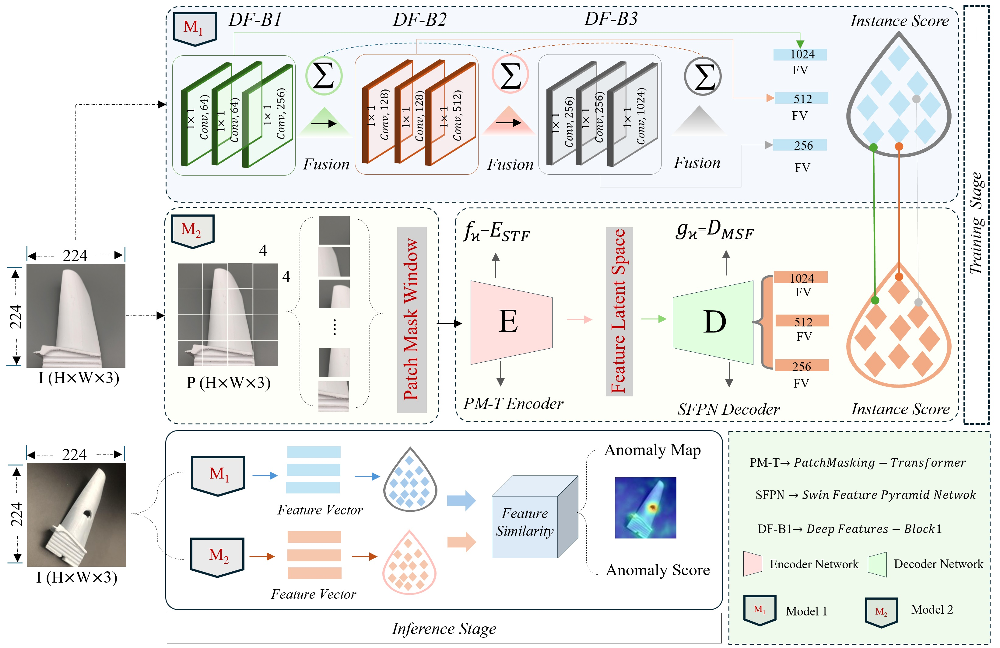

## Industrial Anomaly Detection with Domain Shift: A Real-world Dataset and Masked Multi-scale Reconstruction

This is the official PyTorch implementation of the paper [Adaptive Fusion Strategy with Masked Encoding for Cross-Domain Industrial Image Anomaly Detection], which is inspired by [Industrial Anomaly Detection with Domain Shift: A Real-world Dataset and Masked Multi-scale Reconstruction].
<p align="center">
    
</p>p
    Overview of the proposed framework for industrial anomaly detection. A pretrained feature extractor, M1, generates multi-scale features fusion obtained from intermediate layers. These are combined with multi-level features produced by a trainable PM-T Encoder and SFPN decoder in M2. The model is trained by maximizing feature similarity across scales. The inference stage detects anomalous regions by comparing multi-level feature similarities.

### Datasets

We tested our model on two publicly available datasets, AeBAD and MVTec.

**Download AeBAD dataset at [here](https://drive.google.com/file/d/14wkZAFFeudlg0NMFLsiGwS0E593b-lNo/view?usp=share_link) (Google Drive) or [here](https://cloud.189.cn/web/share?code=nYraE3uMRJn2) (access code: g4pr) (Tian Yi Yun Pan).**

### Get Started

#### Dataset

**MVTec:**

**Create the MVTec dataset directory**. Download the MVTec-AD dataset from [here](https://www.mvtec.com/company/research/datasets/mvtec-ad). The MVTec dataset directory should be as follows. 

```
|-- data
    |-- MVTec-AD
        |-- mvtec_anomaly_detection
            |-- object (bottle, etc.)
                |-- train
                |-- test
                |-- ground_truth
```

**AeBAD:**

Download the AeBAD dataset from the above link. The AeBAD dataset directory should be as follows.

```
|-- AeBAD
    |-- AeBAD_S
        |-- train
            |-- good
                |-- background
        |-- test
                |-- ablation
                    |-- background
        |-- ground_truth
                |-- ablation
                    |-- view
    |-- AeBAD_V
        |-- test
            |-- video1
                |-- anomaly
        |-- train
            |-- good
                |-- video1_train
```

**Note that background, view and illumination in the train set is different from test. The background, view and illumination in test is unseen for the training set.**

#### Virtual Environment

Use the following commands:
```
pip install -r requirements.txt
```

#### Train and Test for MVTec, AeBAD

Train the model and evaluate it for each category or different domains. This will output the results (sample-level AUROC, pixel-level AUROC and PRO) for each category. It will generate the visualization in the directory.

run the following code:

```
sh mvtec_run.sh
```

```
sh AeBAD_S_run.sh
```

```
sh AeBAD_V_run.sh
```

TRAIN.MMR.model_chkpt in MMR.yaml is the path of above download model. TRAIN.dataset_path (TEST.dataset_path) is the path of data.
Set Test.save_segmentation_images as True or False to save processed image.

## Acknowledgement
We acknowledge the excellent implementation from [MMR](https://github.com/zhangzilongc/MMR), [MAE](https://github.com/facebookresearch/mae), [SWIN-MAE](https://github.com/Zian-Xu/Swin-MAE).


